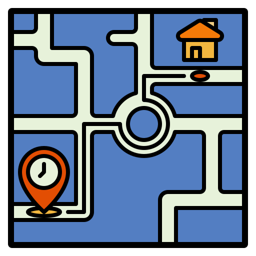
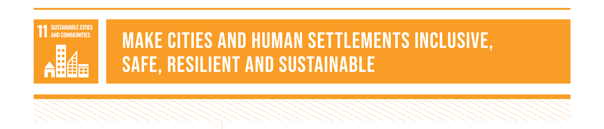
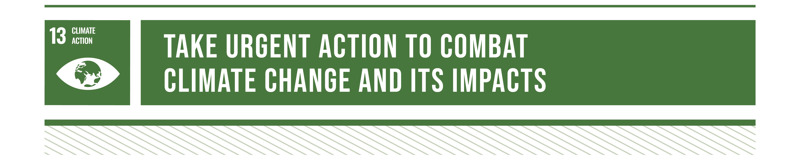

  

  <h1 align="center">San Daan?</h1>

  <h3 align="center">
    🚕 A mobile app for commuters, by commuters. 🚕
  </h3>
  

    <b>CS-1202</b>  
    Capinpin, Kobe Andrew  
    Cuarto, Mico Raphael  
    Jocson, Vladimir  
    Penuliar, Alexander Guile
  

   

  
Table of Contents

  <ol>
    <li>
      <a href="#🔍-introduction">Introduction</a>
    </li>
    <li>
      <a href="#🌏-problem-statement">Problem Statement</a>
    </li>
    <li><a href="#🌱-purpose">Purpose</a></li>
    <li><a href="#🎯-objectives">Objectives</a></li>
    <li><a href="#👨‍👨‍👦‍👦-significance">Significance</a></li>
    <li><a href="#📋-planned-features">Planned Features</a></li>
    <li><a href="#💻-technical-requirements">Technical Requirements</a></li>
    <li><a href="#🔭-scope-of-the-project">Scope of the Project</a></li>
  </ol>

 

## 🔍 Introduction

Commuting can be a stressful and time-consuming process, with traffic conditions and other unforeseen events often causing delays and frustration. Additionally, the transportation sector is a significant contributor to greenhouse gas emissions that contribute to climate change. To address these challenges, a navigation app for commuters will be developed.

This project aims to develop an app-based navigation system that will help commuters in Batangas City to travel efficiently. The app will provide accurate and up-to-date information on transportation schedules, traffic conditions, and directions, making it easier for users to plan their journeys and promoting sustainable transportation solutions.

Furthermore, the app-based navigation system can contribute to achieving the Sustainable Development Goals (SDGs), particularly SDG 11, which aims to make cities and human settlements more inclusive, safe, resilient, and sustainable, and SDG 13, which seeks to take urgent action to combat climate change and its impacts. By promoting sustainable transportation solutions and reducing greenhouse gas emissions, the app-based navigation system can make a valuable contribution towards achieving these global goals.

## 🌏 Problem Statement

Despite the rapid advancement of technology and the information we have access to, many people still lack accessible information about sustainable transportation. Public transit remains the primary means of transportation for many, making it crucial to provide easily accessible information on options that support SDGs 11 and 13.

 

SDG 11 emphasizes the need for more inclusive and sustainable cities and communities, with a focus on enhancing the accessibility, security, and environmental friendliness of transportation systems. Sustainable transportation is key to achieving this goal, as it can help reduce traffic congestion, air pollution, and greenhouse gas emissions, while also improving citizens' quality of life and public health.

 

SDG 13 aims to tackle climate change and its effects as soon as possible. Transportation is a significant source of greenhouse gas emissions, making the shift to more environmentally friendly means of transportation crucial to achieving this goal. Promoting sustainable transportation options can reduce the carbon footprint of transportation systems and mitigate the effects of climate change.

Currently, there is a lack of tools that use information about the schedules, routes, and usage of public transportation to offer environmentally friendly options to users. This restricts people from making informed decisions that align with global sustainable development goals. A technology that can effectively compile information on available public transportation options, analyze it, and offer consumers personalized recommendations for more environmentally friendly solutions is needed to address this problem. Such a tool would support the global effort to attain SDGs 11 and 13 by promoting environmentally friendly transportation and reducing carbon emissions.

## 🌱 Purpose

The primary objective of this project is to help people by developing a mobile-based application that promotes the use of efficient and environmentally-friendly public transportation routes. This will be accomplished by providing accurate and real-time information on public transportation schedules, routes, and various options available to commuters. The app will enable users to easily search for transportation options based on their location, destination, and travel time preferences. Additionally, a community-driven system will be incorporated into the app, allowing users to share their preferred routes based on previous travels and preferences, and make them accessible to other users.

This system is expected to not only make public transportation more accessible and efficient for users but also encourage more individuals to contribute to this feature and keep the project relevant over an extended period. By promoting sustainable transportation options, the project will contribute towards achieving the Sustainable Development Goals (SDGs), particularly SDG 11, which emphasizes making cities and human settlements more inclusive, safe, resilient, and sustainable. Ultimately, the mobile application will help people choose the best transportation options, reduce travel time and cost, and minimize the environmental impact of public transportation.

## 🎯 Objectives

* 💽 Develop a data scraper that can collect and analyze data on public transportation schedules and routes from various sources.

* 📲 Integrate the collected data into a user-friendly mobile-based application that allows users to easily search for transportation options based on their current location, destination, and preferred travel time.

* 🗣️ Conduct user testing and feedback sessions to ensure that the platform is user-friendly and provides accurate and helpful information to users.

* ✔️ Continuously update the platform with the latest data on public transportation schedules and routes to ensure the accuracy of the recommendations provided to users. This will involve utilizing data from the users as well.

## 👨‍👨‍👦‍👦 Significance

* 🎓 **Students**: Since they often rely on public transportation to get to school or college, making access to sustainable transportation options is especially critical. This program will serve to aid students in selecting environmentally responsible transportation options, identifying the most efficient routes, and reducing their carbon footprint by providing information on sustainable transportation choices. 

* 🚌 **Commuters**: They are significant contributors to carbon emissions, and providing them with information on environmentally friendly transportation options can help to mitigate their environmental impact. Additionally, commuting can be a stressful experience, and this program can alleviate some of that stress by offering personalized and efficient transit options.

* 🛫 **Tourists**: In unfamiliar cities, tourists frequently rely on public transportation to get around and may need to be made aware of more environmentally friendly options. This resource can assist tourists in choosing the most effective mode of transportation to get them to where they're going and minimize the impact of their travels on the environment.

* 🚗 **Drivers**: Even if unfamiliar with sustainable transportation options, they may find this program beneficial in reducing their carbon footprint. They could reduce their carbon footprint by supporting different forms of transportation, including biking or public transportation, and choosing the most efficient route. With the help of this program, drivers may be encouraged to choose more environmentally friendly options.

* 🚕 **Public Transportation Drivers**: By providing recommendations for more efficient routes or forms of transportation, this program can also help public transportation drivers. They can help create more sustainable transportation systems by conserving fuel and optimizing their routes more efficiently.

## 📋 Planned Features

The mobile app will have features that mainly aim to make commuting more convenient for commuters Specifically, the app will have the following features:

* 📱 Available on Android devices

* 🛰️ Realtime location tracking using GPS

* 🗺️ Interactive map where users can mark destinations and check places

* ↗️ Route suggestions using only public transport such as jeepneys and buses

* 🚌 Contains information on transport vehicle routes and schedules

* 👨‍👩‍👧‍👦 Community-powered: users can share transport routes and update transport vehicle schedules for other users to see

## 💻 Technical Requirements

To speed up and improve the development of the mobile application, the developers will use various tools. These include:

* [**Python**](https://www.python.org/) - a high-level, general-purpose programming language. This will be used to program the logic for the application.

* [**Kivy**](https://kivy.org/) - a cross-platform Python application development framework. This will be used to create an application that can run in android.

* [**OpenStreetMap**](https://www.openstreetmap.org/) - a free, open geographic database updated and maintained by a community of volunteers via open collaboration. This will be used to obtain map data such as names of places and routes through its API.

* [**MySQL**](https://www.mysql.com/) - an open-source relational database management system. This will be used to store the information about the routes and places as well as the transport schedules shared by users.

* [**Conda**](https://conda.io/) - an open-source, cross-platform, language-agnostic package manager and environment management system. This will be used to ensure that the developers of the project work on the same virtual environment with the same modules with the same exact versions.

* [**GitHub**](https://github.com/) - an Internet hosting service for software development and version control using Git. This will be used to make collaboration more convenient for the developers of the project.

## 🔭 Scope of the Project

The aim of the project is to develop an app-based navigation system to help commuters in Batangas City access real-time information on public transportation schedules, traffic conditions, and alternative route suggestions. The app will be accessible to both public and private transportation users and will feature a community-powered planning feature for users to customize their own transport route based on their preferences.

However, the accuracy of the data in the app, such as traffic and transportation schedules, is dependent on the reliability of the data sources. The app will only be available on Android devices, limiting the accessibility for some users who may not have access to this technology. Additionally, features such as lane guidance, street view, and voice command will not be included in the initial release of the app. These limitations will be taken into account during the development process, and efforts will be made to ensure the app is as reliable and accessible as possible.
