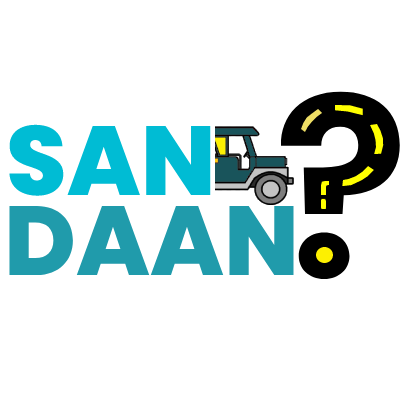

<div align="center">
  <a href="https://raw.githubusercontent.com/baddddddddd/bourgeoisie/main/images/logo1_anim.gif">
    
  </a>

  <h1 align="center">San Daan?</h1>

  <h3 align="center">
    🚕 A mobile app for commuters, by commuters. 🚕
  </h3>
  <p align="center">
    <b>CS-1202</b> <br>
    <a href="https://github.com/VinnRe">Capinpin, Kobe Andrew</a> <br>
    <a href="https://github.com/oocim">Cuarto, Mico Raphael</a> <br>
    <a href="https://github.com/baddddddddd">Jocson, Vladimir</a> <br>
    <a href="https://github.com/Exuille">Penuliar, Alexander Guile</a>
  </p>
  <br>
</div>

<details>
  <summary>Table of Contents</summary>
  <ol>
    <li>
      <a href="#-introduction">Introduction</a>
    </li>
    <li>
      <a href="#-problem-statement">Problem Statement</a>
    </li>
    <li><a href="#-purpose">Purpose</a></li>
    <li><a href="#-objectives">Objectives</a></li>
    <li><a href="#-significance">Significance</a></li>
    <li><a href="#-features">Features</a></li>
    <li><a href="#-technical-requirements">Technical Requirements</a></li>
    <li><a href="#-scope-of-the-project">Scope of the Project</a></li>
    <li><a href="#uml-diagram">UML Diagram</a></li>
    <li><a href="#presentation">Presentation</a></li>
    <li><a href="#running-the-app">Developer Section</a></li>
  </ol>
</details>

<br>

<hr class="w-48 h-1 mx-auto my-4 bg-gray-100 border-0 rounded md:my-10 dark:bg-gray-700">

## 🔍 Introduction

Commuting can be a stressful and time-consuming process, with traffic conditions and other unforeseen events often causing delays and frustration. Additionally, the transportation sector is a significant contributor to greenhouse gas emissions that contribute to climate change. To address these challenges, a navigation app for commuters will be developed.

This project aims to develop an app-based navigation system that will help commuters in Batangas City to travel efficiently. The app will provide accurate and up-to-date information on transportation schedules, traffic conditions, and directions, making it easier for users to plan their journeys and promoting sustainable transportation solutions.

Furthermore, the app-based navigation system can contribute to achieving the Sustainable Development Goals (SDGs), particularly SDG 11, which aims to make cities and human settlements more inclusive, safe, resilient, and sustainable, and SDG 13, which seeks to take urgent action to combat climate change and its impacts. By promoting sustainable transportation solutions and reducing greenhouse gas emissions, the app-based navigation system can make a valuable contribution towards achieving these global goals.

<hr class="w-48 h-1 mx-auto my-4 bg-gray-100 border-0 rounded md:my-10 dark:bg-gray-700">

## 🌏 Problem Statement

Despite the rapid advancement of technology and the information we have access to, many people still lack accessible information about sustainable transportation. Public transit remains the primary means of transportation for many, making it crucial to provide easily accessible information on options that support SDGs 11 and 13.

<br>
<a href="https://sdgs.un.org/goals/goal11">
  
</a>

SDG 11 emphasizes the need for more inclusive and sustainable cities and communities, with a focus on enhancing the accessibility, security, and environmental friendliness of transportation systems. Sustainable transportation is key to achieving this goal, as it can help reduce traffic congestion, air pollution, and greenhouse gas emissions, while also improving citizens' quality of life and public health.

<br>
<a href="https://sdgs.un.org/goals/goal13">
  
</a>

SDG 13 aims to tackle climate change and its effects as soon as possible. Transportation is a significant source of greenhouse gas emissions, making the shift to more environmentally friendly means of transportation crucial to achieving this goal. Promoting sustainable transportation options can reduce the carbon footprint of transportation systems and mitigate the effects of climate change.

Currently, there is a lack of tools that use information about the schedules, routes, and usage of public transportation to offer environmentally friendly options to users. This restricts people from making informed decisions that align with global sustainable development goals. A technology that can effectively compile information on available public transportation options, analyze it, and offer consumers personalized recommendations for more environmentally friendly solutions is needed to address this problem. Such a tool would support the global effort to attain SDGs 11 and 13 by promoting environmentally friendly transportation and reducing carbon emissions.

<hr class="w-48 h-1 mx-auto my-4 bg-gray-100 border-0 rounded md:my-10 dark:bg-gray-700">

## 🌱 Purpose

The primary objective of this project is to help people with the developed mobile-based application that promotes the use of efficient and environmentally-friendly public transportation routes. This will be accomplished by providing accurate and real-time information on public transportation schedules, routes, and various options available to commuters. The app will enable users to easily search for transportation options based on their location, destination, and travel time preferences. Additionally, a community-driven system will be incorporated into the app, allowing users to share their preferred routes based on previous travels and preferences, and make them accessible to other users.

This system makes public transportation more accessible and efficient for users but also encourage more individuals to contribute to this feature and keep the project relevant over an extended period. By promoting sustainable transportation options, the project will contribute towards achieving the Sustainable Development Goals (SDGs), particularly SDG 11, which emphasizes making cities and human settlements more inclusive, safe, resilient, and sustainable. Ultimately, the mobile application will help people choose the best transportation options, reduce travel time and cost, and minimize the environmental impact of public transportation.

<hr class="w-48 h-1 mx-auto my-4 bg-gray-100 border-0 rounded md:my-10 dark:bg-gray-700">

## 🎯 Objectives

* 💽 Develop a data scraper that can collect and analyze data on public transportation schedules and routes from various sources.

* 📲 Integrate the collected data into a user-friendly mobile-based application that allows users to easily search for transportation options based on their current location, destination, and preferred travel time.

* 🗣️ Conduct user testing and feedback sessions to ensure that the platform is user-friendly and provides accurate and helpful information to users.

* ✔️ Continuously update the platform with the latest data on public transportation schedules and routes to ensure the accuracy of the recommendations provided to users. This will involve utilizing data from the users as well.

<hr class="w-48 h-1 mx-auto my-4 bg-gray-100 border-0 rounded md:my-10 dark:bg-gray-700">

## 👨‍👨‍👦‍👦 Significance

* 🎓 **Students**: Since they often rely on public transportation to get to school or college, making access to sustainable transportation options is especially critical. This program will serve to aid students in selecting environmentally responsible transportation options, identifying the most efficient routes, and reducing their carbon footprint by providing information on sustainable transportation choices. 

* 🚌 **Commuters**: They are significant contributors to carbon emissions, and providing them with information on environmentally friendly transportation options can help to mitigate their environmental impact. Additionally, commuting can be a stressful experience, and this program can alleviate some of that stress by offering personalized and efficient transit options.

* 🛫 **Tourists**: In unfamiliar cities, tourists frequently rely on public transportation to get around and may need to be made aware of more environmentally friendly options. This resource can assist tourists in choosing the most effective mode of transportation to get them to where they're going and minimize the impact of their travels on the environment.

* 🚕 **Public Transportation Drivers**: By providing recommendations for more efficient routes or forms of transportation, this program can also help public transportation drivers. They can help create more sustainable transportation systems by conserving fuel and optimizing their routes more efficiently.

<hr class="w-48 h-1 mx-auto my-4 bg-gray-100 border-0 rounded md:my-10 dark:bg-gray-700">

## 📋 Features

The mobile app have features that mainly aim to make commuting more convenient for commuters. Specifically, the app will have the following features:

* 📱 Available on Android devices

* 🛰️ Realtime location tracking using GPS

* 🗺️ Interactive map where users can mark destinations and check places

* ↗️ Route suggestions using only public transport such as jeepneys and buses

* 🚌 Contains information on transport vehicle routes and schedules

* 👨‍👩‍👧‍👦 Users can share transport routes and update transport vehicle schedules for other users to see

<hr class="w-48 h-1 mx-auto my-4 bg-gray-100 border-0 rounded md:my-10 dark:bg-gray-700">

## 💻 Technical Requirements

To speed up and improve the development of the mobile application, the developers will use various tools. These include:

* [**Python**](https://www.python.org/) - a high-level, general-purpose programming language. This is used to program the logic for the application.

* [**Kivy**](https://kivy.org/) - a cross-platform Python application development framework. This is used to create an application that can run in android.

* [**Flask**](https://flask.palletsprojects.com/) - a python web framework for developing static web pages. This is used to create the RESTful API for the project to handle all computation-heavy tasks.

* [**OpenStreetMap**](https://www.openstreetmap.org/) - a free, open geographic database updated and maintained by a community of volunteers via open collaboration. This is used to obtain map data such as names of places and routes through its API.

* [**MySQL**](https://www.mysql.com/) - an open-source relational database management system. This is used to store the information about the routes and places as well as the transport schedules shared by users.

* [**Docker**](https://www.docker.com/) - a software platform that allows developers to build, test, and deploy applications quickly. It ensures that the application running in one machine will run on all the other machines. This is used to containerize the API application so that the developers can deploy it to the server online.

* [**Linux**](https://www.linux.org/) - a family of open-source Unix-like operating systems based on the Linux kernel, an operating system kernel. This is used to run the API server locally and natively as well as for building the Android app from source.

* [**GitHub**](https://github.com/) - an Internet hosting service for software development and version control using Git. This is used to make collaboration more convenient for the developers of the project.

<hr class="w-48 h-1 mx-auto my-4 bg-gray-100 border-0 rounded md:my-10 dark:bg-gray-700">

## 🔭 Scope of the Project

The aim of the project is to develop an app-based navigation system to help commuters in Batangas City access real-time information on public transportation schedules, traffic conditions, and alternative route suggestions. The app will be accessible to both public and private transportation users and will feature a community-powered planning feature for users to customize their own transport route based on their preferences.

However, the accuracy of the data in the app, such as traffic and transportation schedules, is dependent on the reliability of the data sources. The app will only be available on Android devices, limiting the accessibility for some users who may not have access to this technology. Additionally, features such as lane guidance, street view, and voice command will not be included in the initial release of the app. These limitations will be taken into account during the development process, and efforts will be made to ensure the app is as reliable and accessible as possible.

<hr class="w-48 h-1 mx-auto my-4 bg-gray-100 border-0 rounded md:my-10 dark:bg-gray-700">

## UML Diagram


<hr class="w-48 h-1 mx-auto my-4 bg-gray-100 border-0 rounded md:my-10 dark:bg-gray-700">

## Presentation

Video Presentation YouTube Link: https://www.youtube.com/watch?v=4sIvN9gS_E4

<hr class="w-48 h-1 mx-auto my-4 bg-gray-100 border-0 rounded md:my-10 dark:bg-gray-700">

## Running the App
### Windows and Linux
1. Clone the repository in your machine
```sh
git clone https://github.com/baddddddddd/SanDaan.git
cd SanDaan
```
2. Download all the dependencies (we recommend using a virtual environment before proceeding to this step)
```sh
pip install -r requirements.txt
```
3. Run the app
```sh
python src/app/main.py -- --online
```
### Android 11 and older
1. Download the .apk file from our releases page. Check out our [latest release](https://github.com/baddddddddd/SanDaan/releases/latest).
2. Allow installation from unknown sources in your android device then install the .apk.
3. Open the app once to allow requested permissions then close.
4. Open the app again and enjoy :D

**Disclaimers**

* Android 12 and newer versions of Android is currently not supported by the latest release.
* The app is also not supported for Android devices that do not have GPS Location Tracking.
* If the app closes automatically or is stuck in the loading screen, this means that the server is turned off or sleeping. Please contact the developers to turn on or wake up the server. Additionally, you can wake the server up yourself by visiting [this link](https://sandaan-api.onrender.com/ping) and wait for the page to load.

## Waking up the server
If the app is stuck in the loading screen, chances are the server is turned off due to limited resources or is sleeping. 
Visit [this link](https://sandaan-api.onrender.com/ping) and wait for the page to load to wake up the server. 
If the page still failed to respond, the server is turned off. Please contact the developers in case this happens.

## Hosting the API server locally
Optionally, you can host the API server locally in your machine.

**Disclaimer**

Running the server requires having the environment variables to connect to our database. In order to obtain these environment variables, please contact the developers. Optionally, you can host your own database
with the database schema (src/api/db_schema.sql) that we provided.

### Linux
1. Clone the repository in your machine
```sh
git clone https://github.com/baddddddddd/SanDaan.git
```
2. Navigate to the API folder
```sh
cd SanDaan/src/api
```
3. Download all the dependencies (we recommend using a virtual environment before proceeding to this step)
```sh
pip install -r requirements.txt
```
4. Run the server using gunicorn
```sh
gunicorn api:app -b 0.0.0.0:5000 --timeout 300
```
### Docker and Non-Linux Machines
1. Download and install Docker in your machine.
2. Create the docker image.
```sh
docker build -t sandaan-api .
```
3. Run the docker image.
```sh
docker run -p 5000:5000 sandaan-api
```
### Connecting the app to the locally hosted server
1. Repeat the steps from [Running the App](#running-the-app) section except for the last step.
2. Run the app without the "--online" argument.
```sh
python src/app/main.py
```

## Building the Android app from source
Building the app from source is only supported on linux machines.
1. Download and install "buildozer" in your linux machine as well as all of its dependencies.
2. Build the .apk using buildozer
```sh
buildozer android debug
```
3. Navigate to the "bin" directory to find the .apk
